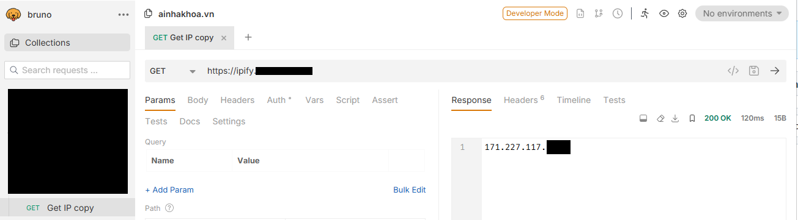

#ipify-same-same

Public IP Provider (ASP.NET Core 10)
A lightweight, AOT‑compiled service that exposes your public IPv4/IPv6 addresses via HTTP.
Ideal for low‑power servers, VPN routers or any environment where a static IP is not available.

🚀 Quick Start
# Upload the image
Use tool like WinSCP to connect, then drag and drop the downloaded image into any where you want.

# Load the image
```
docker load -i ipify.tar
```

# After load, you can remove the tar file
```
rmi ipify.tar
```

# Run the container (internal port 8080, host port 80 or whatever you want)
```
docker run -d --name ip-provider -p 80:8080 ipify:latest
```
After the image is loaded you’ll only see ~12 MB on disk.

You can now access:

Endpoint	Description

/v4	Returns the current public IPv4 address

/v6	Returns the current public IPv6 address

/	Alias for /v4 (default)

Example:
```
curl http://your-server-ip/v4   # ← IPv4
curl http://your-server-ip/v6   # ← IPv6
```

Not working ?
If nginx is running, we need checking the configuration files and make sure they have:
proxy_set_header X-Forwarded-For $remote_addr;
proxy_set_header X-Real-IP       $remote_addr;
proxy_set_header Host            $host;

📈 Why Use This Service?
No static IP needed – The service will always return your current public address, making dynamic DNS updates trivial.
Simple integration with DDNS clients – Update your DNS zone with tools like ddclient, ddns-updater, or any custom script.
Fast & Small – AOT compilation reduces startup time and keeps the Docker image lightweight (≈12 MB).
Cross‑platform – Run on any Linux distribution, even low‑powered VPS or embedded devices.

💡 Use‑Case Scenarios
Scenario	How the service helps
Low‑power VPS	Provides a single IP endpoint for scripts and services.
Dynamic DNS	Supplies a stable source for any DDNS updater.
Remote access	Exposes your server’s public IP for NAT‑traversal tools.

🤝 Need a Server?
If you don’t have a dedicated machine, feel free to message me.
I can share free resources, but please do not spam the API.
Respectful usage ensures continued community support.

📄 License
FREE for any purpose without License.

Test:

